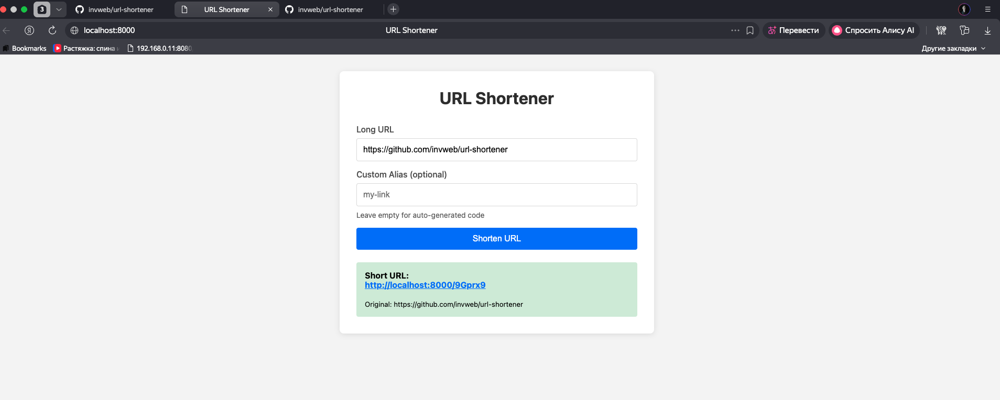

# URL Shortener

A PHP URL shortener service with statistics and REST API.

## Screenshots



## Features

- Shorten URLs with auto-generated or custom aliases
- Redirect short URLs to original destinations
- Track click statistics (IP, user agent, referrer, daily counts)
- REST API for programmatic access
- SQLite database (no external dependencies)

## Requirements

- PHP 8.2 or higher
- SQLite extension

## Installation

```bash
composer install
```

## Usage

### Start Development Server

```bash
php -S localhost:8000 -t public
```

Open http://localhost:8000 in your browser.

### API Endpoints

#### Shorten URL
```bash
curl -X POST http://localhost:8000/api/shorten \
  -H "Content-Type: application/json" \
  -d '{"url": "https://example.com/very-long-url"}'
```

#### Shorten with Custom Alias
```bash
curl -X POST http://localhost:8000/api/shorten \
  -H "Content-Type: application/json" \
  -d '{"url": "https://example.com", "custom_alias": "my-link"}'
```

#### Get URL Info
```bash
curl http://localhost:8000/api/urls/{id}
```

#### Get Statistics
```bash
curl http://localhost:8000/api/stats/{code}
```

#### List All URLs
```bash
curl http://localhost:8000/api/urls
```

#### Delete URL
```bash
curl -X DELETE http://localhost:8000/api/urls/{id}
```

#### Health Check
```bash
curl http://localhost:8000/health
```

## Project Structure

```
url-shortener/
├── src/
│   ├── Controllers/     # Request handlers
│   ├── Core/            # Framework (Router, Database)
│   ├── Exceptions/      # Custom exceptions
│   ├── Models/          # Data models
│   └── Services/        # Business logic
├── tests/
│   └── Services/        # Unit tests
├── public/              # Web root
├── config/              # Configuration
├── database/            # Migrations
├── phpunit.xml          # PHPUnit config
└── composer.json
```

## Testing

```bash
composer test
```

Or directly:

```bash
./vendor/bin/phpunit
```

## License

MIT
